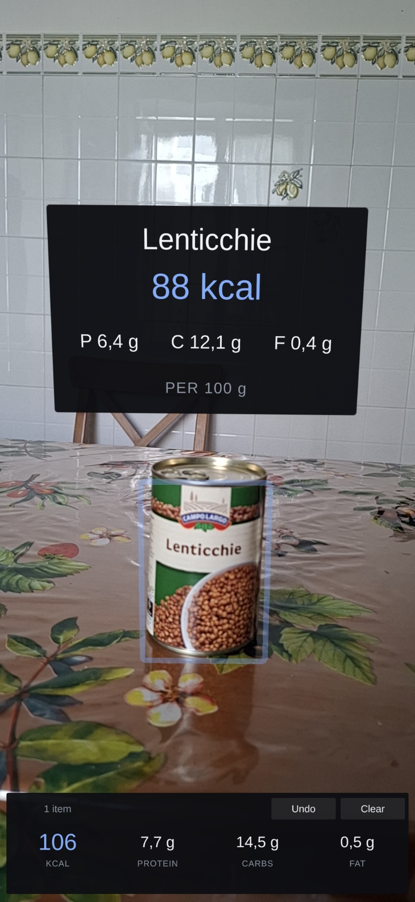
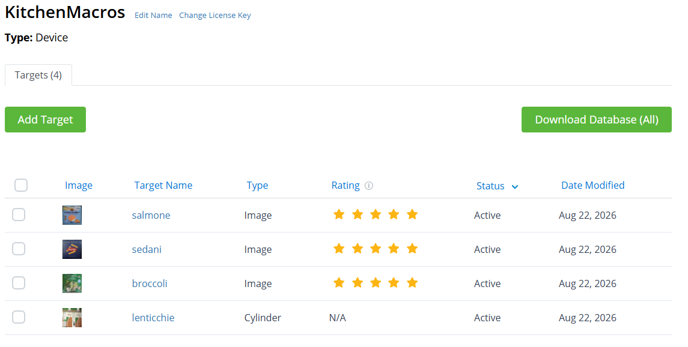
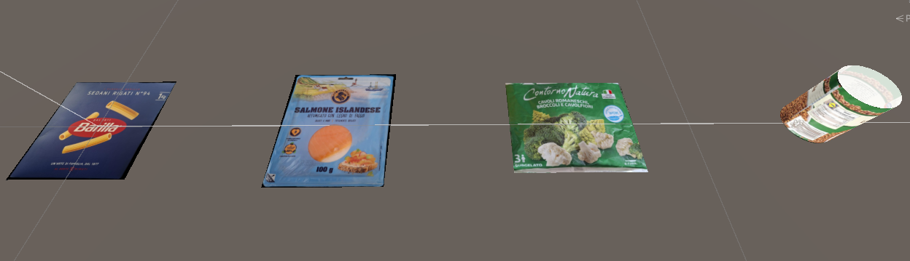
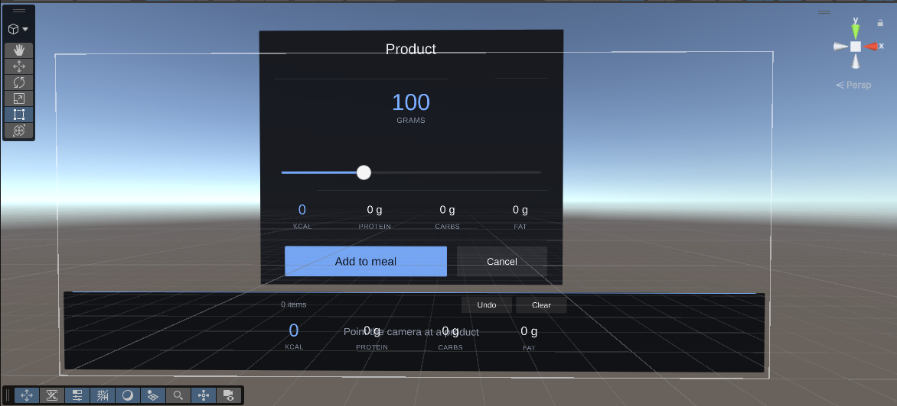
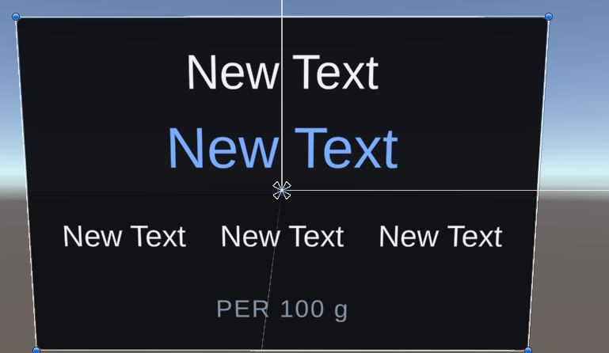

# KitchenMacros, An AR Macro Counter for Kitchen Products

Federico Cerra [S5513839] Augmented Reality Project


---

## 1. How it works

1. The camera recognises a registered food package.
2. A panel showing calories, protein, carbohydrates and fat per 100 g appears anchored above
   the physical product.
3. Tapping the product opens a card where you set the portion with a slider.
4. Confirming adds the item to the meal, and a bar at the bottom of the screen keeps the
   running total.

I registered four products: a box of pasta, a package of smoked salmon, a package of
broccoli, and a can of lentils. The first three are flat Image Targets, the can is a Cylinder
Target.




## 2. Tools, Libraries and SDKs

- **Unity 6000.5.9f1** for the scene, physics and build pipeline.
- **Vuforia Engine 11.4.4** for tracking.
- Built for **Android (ARM64, IL2CPP)** and tested on a **Samsung Galaxy A56**.

### Why Vuforia and not AR Foundation

I looked at both. AR Foundation is Unity's own wrapper over ARCore and ARKit and it does
image tracking, but its image tracking works on flat reference images only, there is no
cylinder target. Since I wanted the can of lentils in the project, that ruled it out.

Vuforia supports Image, Multi and Cylinder Targets, so it was the obvious choice.

### Render pipeline

I started on URP because it is the modern default, and had to go back as the Vuforia package
declares compatibility with the **Built-in pipeline only**.

### Creating the dataset (Target Manager)

I uploaded photographs of my four packages to the Vuforia Target Manager, which analyses
them, extracts features and rates Image Targets from one to five stars.



## 3. Design and Implementation

### 3.1 The four targets

| Product | Type | Size |
|---|---|---|
| Sedani Rigati (pasta) | Image Target | 18.3 × 19.3 cm |
| Salmone affumicato | Image Target | 18.7 × 22.3 cm |
| Broccoli | Image Target | 21.0 × 17.8 cm |
| Lenticchie (can) | Cylinder Target | ⌀ 7.9 × 10.1 cm |




### 3.2 Product data in JSON

I did not want to hardcode nutritional values into GameObjects. All product data lives in
`Assets/Resources/products.json`, keyed by the Vuforia target name:

```json
{
  "targetName": "lenticchie",
  "displayName": "Lenticchie",
  "kcalPer100g": 88,
  "proteinPer100g": 6.4,
  "carbsPer100g": 12.1,
  "fatPer100g": 0.4,
  "defaultPortionGrams": 120
}
```

The values for the pasta and the lentils come from the packages. The ones for the broccoli
and the salmon are estimates.

### 3.3 What goes in world space and what goes on the screen

- **The nutrition panel is in world space**, anchored over the package.
- **The meal total is on the screen.** It belongs to the session, not to any object, and it
  has to stay readable when nothing is being tracked at all.
- **The portion selector is also on the screen**, even though it describes one specific
  product. A slider anchored in the world would shake with the tracking pose precisely while
  you are dragging it.

The world-space panels are billboarded to face the camera. I use *screen-aligned* billboarding
(copying the camera's rotation).



### 3.4 Interaction: selecting a product

Selection is a raycast from `Camera.main` through the tap point, against a box collider fitted
to each package's real dimensions.

To make it clear what is tappable, each tracked product gets a pulsing outline that turns
solid and changes colour once selected.

### 3.5 Portion entry and visual design

You set the portion with a slider, which starts at a sensible default for that product
(80 g for pasta, 50 g for salmon) and snaps to 5 g steps.

### 3.6 The scripts

| Script | Attached to | What it does |
|---|---|---|
| `ProductCatalog` | `AppRoot` | Holds the data classes, reads products.json, finds a product by target name |
| `MealSession` | `AppRoot` | Keeps the added portions and the running totals |
| `SelectionManager` | `AppRoot` | Turns a tap into a selected product |
| `TrackedProduct` | each of the 4 targets | Links that target to its product, creates the panel, drives the outline |
| `MealHudView` | `KitchenMacrosUI` | Shows the totals in the bottom bar |
| `PortionSelectorPanel` | `KitchenMacrosUI` | The portion card: slider and Add button |
| `ProductInfoPanel` | panel prefab | Fills in the text on the world-space panel |
| `Billboard` | panel prefab, and the can's outline | Turns the object to face the camera |

#### Start-up order

Unity runs every `Awake`, then every `Start`, then `Update` and `LateUpdate` each frame. Here's the activation order of my funcitons:

```
Awake   -200  ProductCatalog        reads the JSON and fills the dictionary
        -150  MealSession           registers itself as Instance
         -50  SelectionManager      registers itself as Instance
           0  TrackedProduct        subscribes to Vuforia's status events
           0  PortionSelectorPanel  hooks up the Add button
           0  MealHudView           hooks up Undo and Clear

Start      0  TrackedProduct        asks the catalog for its product, creates the panel
           0  PortionSelectorPanel  subscribes to OnSelectionChanged
           0  MealHudView           subscribes to OnMealChanged

each frame
  Update      SelectionManager      checks whether the screen was tapped
  Update      TrackedProduct        pulses the outline colour
  LateUpdate  TrackedProduct        places the panel above the product
  LateUpdate  Billboard      (+100) turns it to face the camera
```

The negative numbers make sure the catalog is loaded before `TrackedProduct.Start` asks it
for anything. The `+100` makes sure `Billboard` rotates the panel after it has been moved.

#### The three on `AppRoot`

`AppRoot` is an empty GameObject that exists only to hold them. They are global services:
there is one catalog, one meal and one selection for the whole app, so they do not belong to
any particular object.

`ProductCatalog` does all its work once, in `Awake`. After that it is passive and only
answers `TryGet()` calls. `MealSession` acts when something calls `Add`
or `RemoveLast`, it recalculates and raises `OnMealChanged`. It is not attached to a target
precisely so that losing tracking cannot delete it.

`SelectionManager` is the only script that polls: every frame it asks `Pointer.current`
whether the screen was pressed.

#### One on each target

`TrackedProduct` is the only script that *has* to be on that exact GameObject, because it
needs the `ObserverBehaviour` Vuforia puts there. It wakes up through three different
channels: Vuforia calls it when the target is found or lost, `Update` pulses the outline, and
`LateUpdate` repositions the panel.

#### The two on the canvas

Both are event-driven, neither has an `Update`. `PortionSelectorPanel` listens for a
selection and opens or closes the card; `MealHudView` listens for a meal change and rewrites
the totals.

#### The data classes

`MacroValues`, `ProductData` and `ProductCatalogJson` are plain classes, not
`MonoBehaviour`s, so they are not attached to anything: `JsonUtility` creates them when the
file is read. They live in `ProductCatalog.cs` next to the code that loads them, because a
`MonoBehaviour` has to be alone in a file named after it but a plain class does not.

#### The two on the panel prefab

`ProductInfoPanel` has no Unity methods at all. There
is only `Bind(product)`, which `TrackedProduct` calls once when it creates the panel to show the product's values.

`Billboard` runs in `LateUpdate` because it has to see the pose Vuforia wrote during the
frame. In `Update` it would be rotating against the previous frame's pose and the panel would
visibly lag behind.

#### Per frame pattern

Only three scripts run every frame: `SelectionManager` listening for input, and
`TrackedProduct` and `Billboard` keeping the panel in place. Everything else only wakes up
when something happens.

To recap, Vuforia notifies `TrackedProduct`, which shows the
panel; a tap goes from `SelectionManager` to `PortionSelectorPanel`, which writes to
`MealSession`, which notifies the HUD.

### 3.7 The prefab

One prefab, `Assets/Prefabs/ProductInfoPanel.prefab`. It is the panel that appears over a
product.



## 4. Development Choices and Troubleshooting

### Unrolling the cylinder label

A Cylinder Target in Vuforia needs a flat label image whose width equals the circumference (π·d).
Photographing the can as it looks does not work, because the curve compresses the artwork
towards the edges.

I first tried stitching photos with **Hugin**, but it failed.
I resorted to peeling the paper label off the can and scanned it flat.

### Multi Target: tried and dropped

I tried to use multi targeting, but it ended up being way too difficult to setup.
Vuforia apparently is very strict on the declared scales of the image you input vs the declared width/height/length of the object, also the scales of the images for the front and for the back of the object
have to be almost the exact scale. I couldn't get precise enough images of the front and the back
of my box to do so, so I resorted to just Image Target.

### Standing box vs face-up box

My first placement offset the panel in the target's own coordinate frame. That works for a
box standing upright, where the target's "up" is also the world's "up". It breaks for a
package lying flat on the counter: local "up" points sideways, and the panel ends up lying on
the table next to the product.

I ended up moving the panel along world up, by the size of the
target's bounding box projected onto that axis.

### Only one target at a time

To track multiple items, I had to set Vuforia's
`maxSimultaneousImageTargets` from 1 to 4 (which is the total of my items). It costs
more per frame to track multiple items, I don't know what is the number cutoff that starts to
degrade performance but 4 works fine on my phone.

### Play Mode never worked on my PC

Testing in the editor was not possible: the webcam acquires, goes black, freezes, and
re-acquires roughly every two seconds, with nothing in the Console. I never found the cause.
My best guess is that Unity 6.5 is five minor versions ahead of the 6000.0.38 baseline Vuforia
11.4.4 declares.

On-device builds are completely fine, so I developed on the phone instead.

## 5. Project Resources

- **Repository:** https://github.com/FedericoCerra/kitchen-macros-augmentedReality
- **Demonstration video:** [docs/demo.mp4](docs/demo.mp4)

